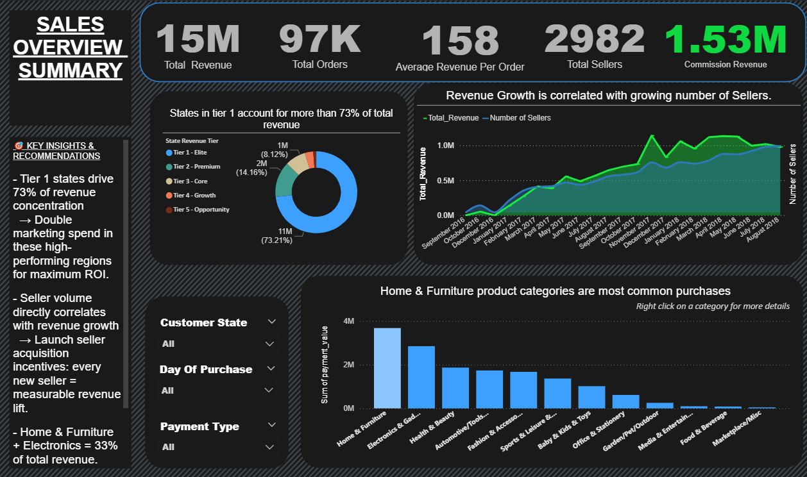
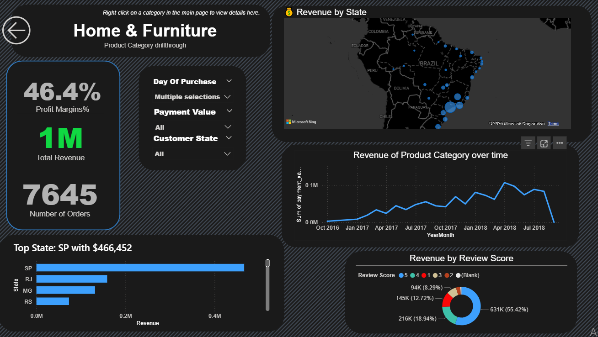
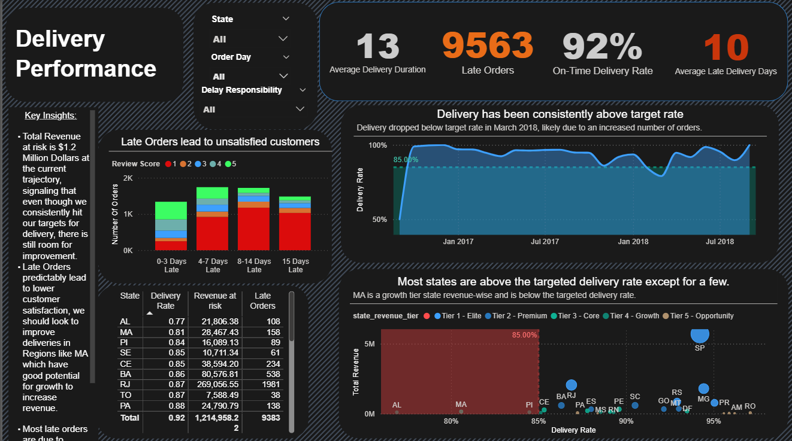
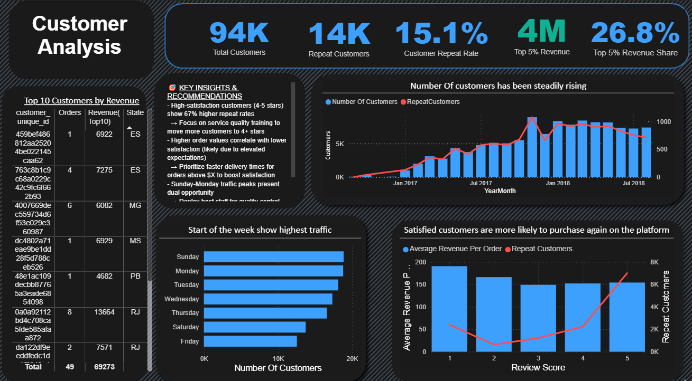

# Olist E-Commerce Insights Dashboard

> **Instant takeaway:** This Power BI dashboard surfaces where revenue is made, where it's leaking, and what to do about it.  
> **Top-line:** **73%** of revenue comes from Tier-1 states → high ROI focus. **Late deliveries risk $1.2M** in revenue → logistics fix needed. **Top 5% customers = 26%** of revenue → prioritize retention.

---

## ⚡Preview of summary page


---

## Table of Contents
- [Overview](#overview)  
- [Why this matters (TL;DR)](#why-this-matters-tldr)  
- [Features](#features)  
- [Dashboard Preview](#dashboard-preview)  
- [How to use / Run locally](#how-to-use--run-locally)  
- [Folder structure](#folder-structure)  
- [Documentation](#documentation)  
- [Tech stack](#tech-stack)  
- [Key Insights (3 bullets for recruiters)](#key-insights-3-bullets-for-recruiters)  
- [Contact](#contact)

---

## Overview
**Project:** Olist E-commerce Performance Analysis  
**Goal:** Turn messy marketplace data into clear actions that increase revenue, reduce churn, and fix logistics.  
**Output:** Interactive Power BI dashboard with drillthroughs, regional maps, delivery-performance diagnostics, and customer-retention analysis.

---

## Why this matters (TL;DR)
- Market concentration creates fast wins — but also single-point risk.  
- Operational problems (delivery) are directly costing revenue and loyalty.  
- A small slice of customers drives a disproportionately large share of revenue — they’re worth protecting.

---

## Features
- Interactive filters: State, Product Category, Day, Payment Type.  
- Drillthrough from Sales → Product Category (right-click drillthrough).  
- KPI cards with instant health checks (Revenue, Orders, Sellers, On-Time Delivery %).  
- Delivery diagnostics: delay buckets, delay responsibility, revenue at risk.  
- Customer analytics: repeat rate, top 5% revenue, day-of-week patterns.  
- Map & scatter visuals highlighting region-level priorities.

---

## Dashboard Preview
> Click the images or open the `.pbix`  for interactive exploration.

**Sales Overview**  


**Product Category Drillthrough**  


**Delivery Performance**  


**Customer Analysis**  


---

## How to use / Run locally
1. Clone repo.  
```bash
git clone <your-repo-url>
cd <repo-folder>

2. Open Power BI Desktop and load the PBIX stored in the dashboard folder:
[Download the Dashboard](.dashboard/Final_Dashboard/Final_Dashboard.pbix)

3. If you want to re-run with the cleaned dataset, point the PBIX data source to:

[Final_Product_Olist](.data/02-cleaned-data/Final_Product_Olist.csv)
[Olist_clean_table](.data/02-cleaned-data/Olist_clean_table.csv)
[olist_orders_dataset](.data/02-cleaned-data/olist_orders_dataset.csv)

4. If Power BI is unavailable, review the screenshots in ./documentation/Snapshots/ and read the docs for the logic & DAX.

Folder structure (what each folder contains)
.git/                          ← Git internal (version control)  
.dashboard/Final_Dashboard/    ← Final .pbix (Power BI file)  
.data/                         
  ├─ raw/                      ← Original CSV files (one-by-one olist CSVs)  
  └─ cleaned/                  ← Cleaned dataset files  
     ├─ Final_Product_Olist.csv  
     └─ Olist_Clean_table.csv
     |__olist_orders_dataset.csv
.documentation/                     
  ├─ Data_Cleaning_Process.md  ← Data cleaning & Power Query steps  
  ├─ Dashboard_Design.md       ← Multi-page dashboard design narrative  
  ├─ Findings_Implications.md  ← Findings & actions  
  └─ Snapshots/                ← All screenshot images used above
.README ← (this file)  
```
Documentation (full)
Read the supporting docs for the why/how and DAX:

[01-Data_Cleaning_Process](./documentation/01-Data_Cleaning_Process.md)
[Dashboard_Design_Documentation](./documentation/02-Dashboard_Design_Documentation.md)
[Findings_&_Business_Implications](./documentation/03-Findings_&_Business_Implications.md)

Tech stack

Power BI Desktop (.pbix) — visuals, interactions, DAX

Excel (Power Query) — initial cleaning, merges, feature engineering

DAX — measures, buckets, calculated columns

Dataset: [Olist_Brazilian_e-commerce CSVs](https://www.kaggle.com/datasets/olistbr/brazilian-ecommerce?select=olist_geolocation_dataset.csv)

#### Key Insights 

73% of revenue comes from Tier-1 states. Focus ad spend and seller acquisition here for fastest ROI.
Late deliveries risk $1.2M in revenue. Fix logistics (MA, SP) and enforce SLAs — this is immediate $$ saved.
Top 5% customers contribute ~26% of revenue. Create a loyalty tier and white-glove treatment to protect this cohort.

Notes, assumptions & limitations
- Commission assumed at 10% where used in measures.
- Numbers are historical.
- Cultural differences in dataset (Brazil) may require interpretation in local context.

Contact: +254700920641
LinkedIn: [Elias_Gichuru](https://www.linkedin.com/in/elias-gichuru-56a2a3250)
Email: Eliasinsights@proton.me
Portfolio: [Elias_Gichuru_Github](https://github.com/Elias-3817)

